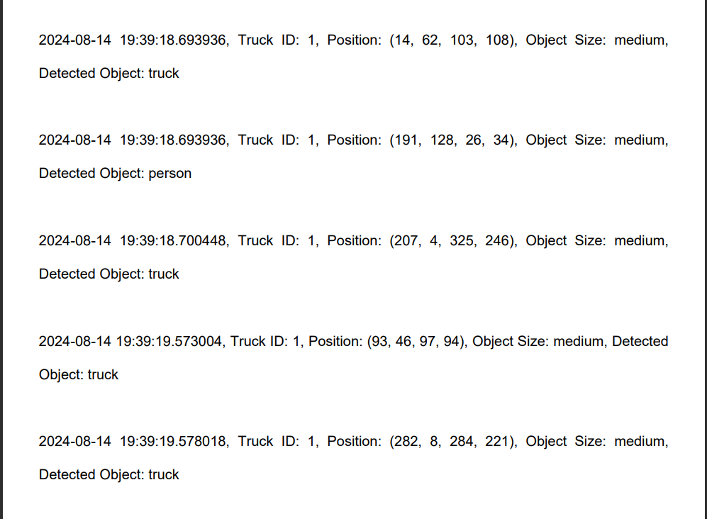
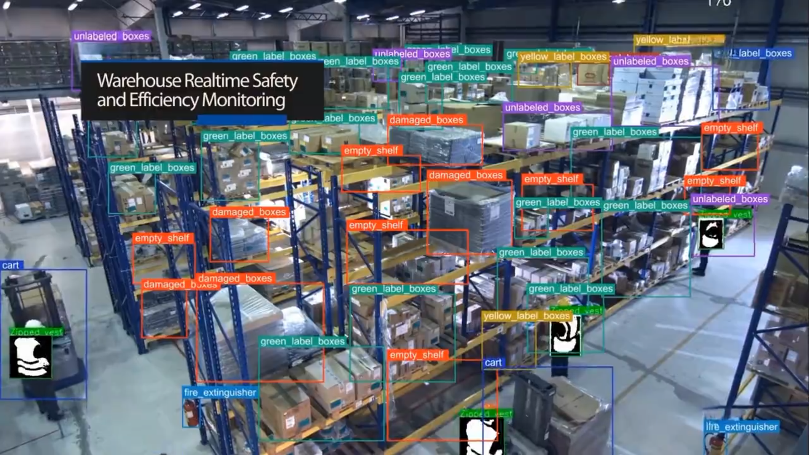
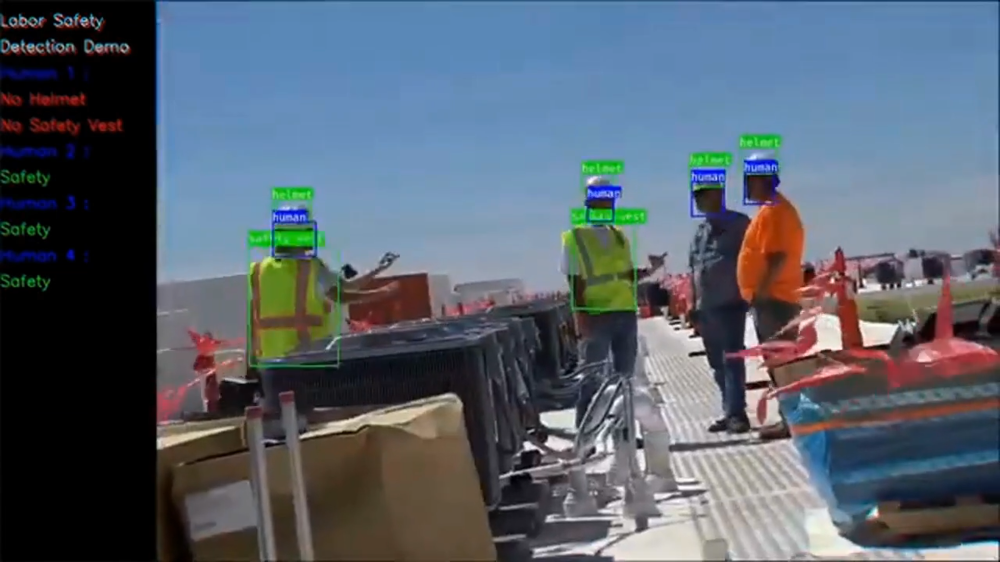
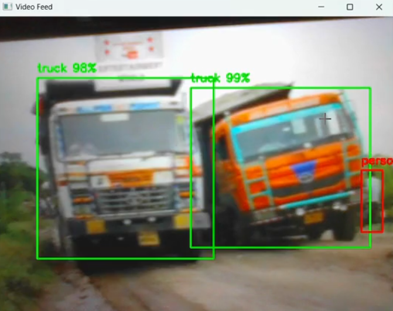

# Walmart Supply Chain Yard Management System

## Overview

This project utilizes AI-powered computer vision to revolutionize Walmart's supply chain operations. The system performs cargo tracking, detects anomalies, monitors worker efficiency, and provides data-driven insights. Leveraging tools like OpenCV, YOLO, and Kafka, it ensures real-time visibility, predictive maintenance, and seamless integration with existing logistics platforms. The scalable architecture is designed for efficient data management, security, and compliance, significantly improving productivity, safety, and operational efficiency. 


## Project Details 
<br>

### About Project
This project aims to create a robust system for real-time monitoring and management of logistics operations. By leveraging advanced technologies, it provides:


- Continuous data capture and processing.
- Real-time insights and automated reporting.
- Enhanced operational efficiency and security.
 The system uses high-resolution cameras for real-time visual monitoring of trucks and cargo. It employs advanced image analysis algorithms to extract critical information, such as truck identifiers, license plates, and cargo details. This data is continuously processed, logged, and reported to improve operational efficiency, security, and compliance.

- **Truck Tracking & Identification**: Automatically tracks trucks within a yard, extracting details such as:
  - License number
  - Truck ID
  - Trailer ID
  - Trailer size
  - Current status
  - Precise location
  
- **Docking Status Monitoring**: Identifies truck docking status at pods, providing live updates on goods being loaded or unloaded.

- **Anomaly Detection**: Detects anomalies such as:
  - Punctured trailer wheels
  - Open doors
  - Potential thefts

- **Automated Data Logging**: Converts monitored video data into textual data, stored in a database for easy retrieval and analysis.

- **Enhanced Operational Efficiency**: Improves productivity, product quality, safety, and overall operational efficiency in supply chain management.

This solution leverages existing CCTV cameras, GPS, and RFID scanners to provide real-time insights and improve logistics operations.


<br> <p  align = "center" width="600" height = "250" >


 https://github.com/user-attachments/assets/13cc664b-d194-4f18-b47d-cd6bd6181067
 
 </p>


<br>

### System design and technical implementation (HLD)

<br>

The architecture includes data capture via cameras and IoT sensors, real-time processing with AI models, and storage in cloud databases. It’s designed for scalability with load balancers, ensuring efficient data handling and system resilience during varying operational workloads.

### Data Capture
- **Camera Setup**: Install and configure high-resolution cameras at strategic locations within the yard.
- **Capture**: Use OpenCV for precise tracking, focusing on key objects like trucks and cargo.

### Data Processing and Storage
- **Storage**: Data is stored in cloud data lakes (e.g., Snowflake, Databricks, Oracle) for large-scale analysis.
- **Real-Time Processing**: AI models (e.g., SageMaker, Metaflow) and computer vision tools (e.g., OpenCV, YOLO v8, Ultra Analytics) are used for processing real-time data.

### Image Processing
- **Pre-Processing**: Utilize OpenCV for resizing, filtering, and normalizing images.
- **Object Detection**: Implement YOLO models for identifying and tracking trucks and cargo.
- **Text Extraction**: Use OCR tools (e.g., EasyOCR) to read license plates and cargo labels.

### Data Management
- **Log Storage**: Extracted data (e.g., truck IDs, cargo details) is stored in a structured format in a database.
- **Real-Time Processing**: Utilize a streaming platform for real-time data processing and analysis.

### Integration
- **APIs**: Develop APIs for seamless integration with existing logistics software and dashboards.
- **User Interface**: Create intuitive dashboards for visualizing data and managing system operations.

### Deployment and Maintenance
- **Deployment**: Use cloud services or on-premises servers for deploying the application.
- **Monitoring**: Set up monitoring tools to track system performance and facilitate maintenance.

### Output and Storage
- **Processed Data Storage**: Processed data, including videos and logs, is stored in a PostgreSQL database.
- **Insights**: This data is used to generate insights on truck traffic, loading/unloading times, and more.

### Scalable System
- **Load Balancing**: A load balancer adjusts processing resources dynamically to handle varying workloads efficiently.


<br> <p  align = "center" >   </p>

### Results, Use Cases, and Future Scope

### Results
- **Truck Movement Insights**: Provides detailed information on truck movements, speeds, and yard arrangements.
- **Efficient Event Logging**: Ensures effective recording of visual events with minimal storage requirements.
- **Predictive Maintenance and Compliance**: Predicts maintenance schedules, assesses truck wear and tear, ensures compliance, and manages authorizations.
- **Seamless Integration**: Connects NoSQL database information to tools like Tableau for real-time data visualization.
- **Enhanced Security Monitoring**: Detects security anomalies, tampering, and other threats, ensuring a secure supply chain environment.

### Use Cases
- **Comprehensive Cargo Tracking**: Tracks and positions cargo, enabling smart arrangements on shelves.
- **Advanced Anomaly Detection**: Identifies theft, potential fires, shelf instability, and accidents in real-time.
- **Enhanced Goods Analysis**: Provides detailed supply chain analysis, including cargo damage detection and metadata recording.
- **Worker Monitoring**: Tracks worker efficiency, ensures safety gear compliance, and facilitates face-recognized attendance.

### Future Scope
- **Expanded Tracking Capabilities**: Enhance cargo tracking to cover more complex scenarios and optimize goods arrangements further.
- **Improved Anomaly Detection**: Develop more sophisticated algorithms to detect a broader range of anomalies.
- **Advanced Data Analysis**: Implement deeper data analysis techniques, including predictive analytics and advanced reporting.
- **Integration with Emerging Technologies**: Explore integration with new technologies such as AI-driven predictive models and IoT advancements for enhanced functionality.


<br> <p  align = "center" width="600" height = "250" >


https://github.com/user-attachments/assets/533842ef-b063-403a-bd9f-e2f8d9293418
 
 </p>


<br> 


## Installation

To set up the environment for this project, follow these steps:

1. **Clone the Repository**:
   ```bash
   git clone https://github.com/deveshruttala/smart-yard.git
   cd your-repository
   ```
2. **Create a Virtual Environment (optional but recommended)** : 
   ```
   python -m venv venv source venv/bin/activate  # On Windows use `venv\Scripts\activate`

   ```
3. **Install Requirements** : 
   ```
   pip install -r requirements.txt
   ```
4. **To run the application, use** :
The main Python file for this project is main.py. It handles the overall data flow,processing with computer vision models, and logging data.

   ```
   python main.py //Use this to run python files directly
   streamlit run main.py //Use this to run streamlit 
   ```

<br> <p>
    
</p>


## Conclusion and credits

Our AI-powered computer vision system advances logistics with real-time tracking, predictive maintenance, enhanced security, and comprehensive cargo tracking, boosting efficiency and integration with analytical tools. We appreciate those who contributed, provided datasets, and supplied footage.<br>
We are committed to continuously improving and expanding the system's capabilities to address evolving challenges and leverage new technologies. Your feedback and suggestions are welcome as we work towards further innovations. 

<br>

check out these links for:<br>

[PPT](https://github.com/deveshruttala/smart-yard/raw/main/assets/walmart%20sparkathon.pptx)<br>

[Presentation Video]()<br>

[Solution Video](https://drive.google.com/file/d/1x5u0ZhdS9Ha2KO68_ljVn0yrVj5Tetww/view?resourcekey)<br>

[Future Scope](https://drive.google.com/file/d/1US7kl1uJtoPFkS2a1-wzQeLithEcm0IP/view?resourcekey)<br>

[Outputs](https://drive.google.com/file/d/1yCBosOoR392LM-yxaze84bjp50brYVJy/view?resourcekey)<br>

[Outputs](https://github.com/deveshruttala/smart-yard/raw/main/assets/code_demo.mp4)<br>

 
thanks for reading! --- devesh  
